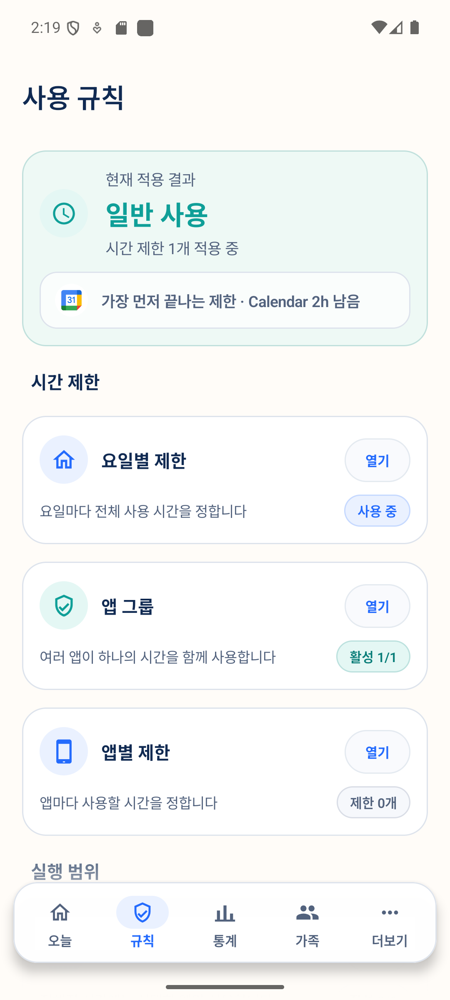
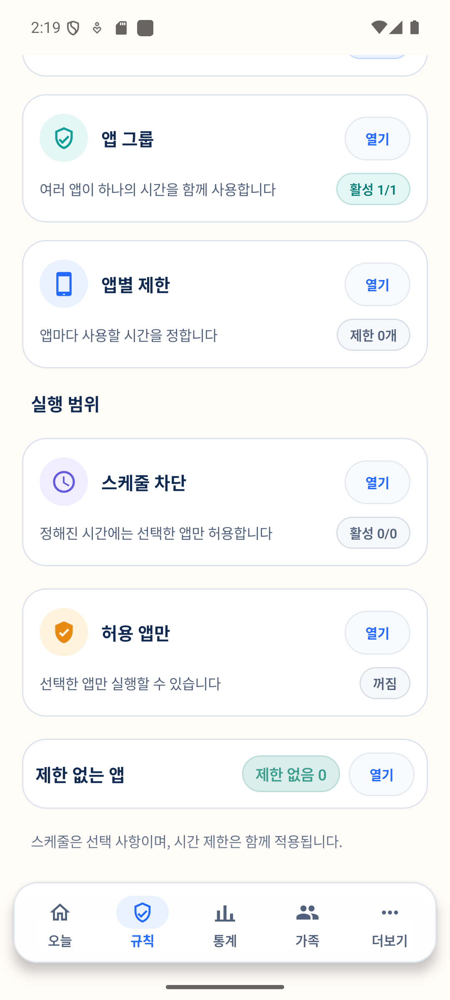
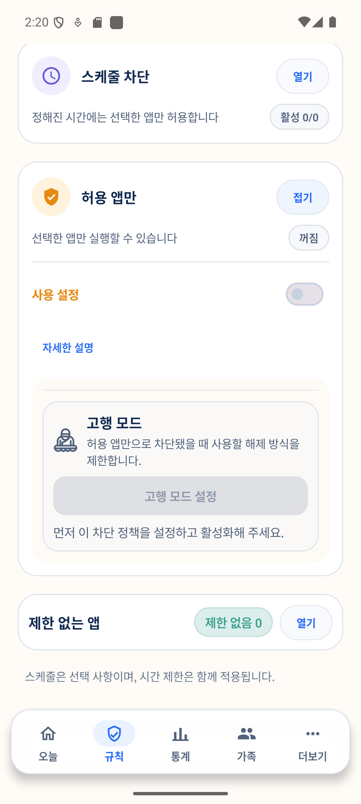

# 웹사이트 허용 목록 기능 검토 보고서

- 검토일: 2026-10-02
- 대상: ScreenRest Android 앱의 `규칙 > 실행 범위` 흐름
- 범위: 구현 가능성, 기술 방식, 저장/차단 구조, 화면 배치, 핵심 UI/UX, 접근성, 단계별 도입안

## 1. 결론

구현할 수 있다. 다만 현재 ScreenRest는 앞에 떠 있는 **앱 패키지**를 판별해 차단하므로, Chrome 안에서 열린 URL을 현재 엔진만으로 구분할 수는 없다. 웹사이트 규칙에는 별도의 웹 탐색 통제 계층이 필요하다.

권장안은 두 단계다.

1. **1차 출시: ScreenRest 관리형 브라우저(WebView) + 외부 브라우저 앱 차단**
   - ScreenRest 브라우저 안에서는 최상위 페이지 URL을 정확히 검사한다.
   - 허용한 사이트와 선택한 관련 주소만 연다.
   - Chrome, Firefox, Samsung Internet 등 외부 브라우저는 기존 앱 차단 엔진으로 막아 우회를 줄인다.
   - 기존 안전 모드, 규칙 적용 스위치, 관리 PIN, 초안 저장 흐름을 그대로 재사용할 수 있다.

2. **후속 검토: 로컬 VPN 기반 외부 브라우저 지원**
   - 여러 브라우저를 계속 쓰게 하려면 `VpnService` 기반 도메인 필터가 필요하다.
   - 시스템 동의, VPN 충돌, 암호화된 DNS/HTTPS/QUIC, 배터리, 항상 켜짐 설정 등 운영 난도가 높다.
   - VPN 계층에서는 일반적으로 전체 URL 경로보다 호스트/도메인 단위 판별만 현실적이고, 웹 페이지의 외부 CDN·로그인 도메인 의존성 때문에 단순한 “목록 외 모든 네트워크 요청 차단”은 페이지를 깨뜨릴 수 있다.

AccessibilityService로 브라우저 주소창을 읽는 방식은 주 방식으로 권장하지 않는다. 브라우저별 UI 구조에 의존해 쉽게 깨지고, ScreenRest는 현재 AccessibilityService를 manifest에서 제거한 상태이며, Play 등록정보·앱 내 고지·동의 등 정책 부담도 다시 생긴다.

## 2. 현재 제품 흐름 근거

### 화면 1 — 규칙 진입



건강도: **양호**. 현재 적용 결과를 먼저 보여주고 `시간 제한` 아래에 요일별·그룹·앱별 규칙을 배치해 구조가 이해하기 쉽다.

### 화면 2 — 실행 범위



건강도: **양호하지만 카드 수 증가에 주의**. `스케줄 차단`, `허용 앱만`, `제한 없는 앱`이 같은 계층에 있다. 웹사이트 허용 목록도 시간 예산이 아니라 “무엇을 실행할 수 있는가”에 해당하므로 여기에 들어가는 것이 자연스럽다.

### 화면 3 — 허용 앱만 상세



건강도: **재사용하기 좋음**. 접기/펼치기, 사용 설정, 상세 설명, 고행 모드, 단일 저장 흐름을 웹 규칙에도 재사용할 수 있다. 다만 웹 규칙을 이 카드 안에 종속시키면 “앱 허용”과 “사이트 허용”의 적용 범위가 섞이므로 독립 카드가 낫다.

## 3. 권장 정보 구조와 위치

`규칙 > 실행 범위`의 순서를 다음처럼 권장한다.

1. 스케줄 차단
2. 허용 앱만
3. **허용 웹사이트만** — 새 카드
4. 제한 없는 앱

새 카드의 접힌 상태는 다음 정보만 보여준다.

- 제목: `허용 웹사이트만`
- 설명: `ScreenRest 브라우저에서 선택한 사이트만 열 수 있습니다`
- 상태 배지: `꺼짐`, `3개 허용`, `설정 필요` 중 하나
- 동작: `열기` / `접기`

관리형 브라우저 방식에서는 제품이 지원 범위를 숨기지 않아야 한다. `모든 브라우저에서 적용`처럼 오해할 문구는 쓰지 않는다.

## 4. 상세 화면 UX

### 4.1 기본 구조

카드를 펼치면 아래 순서를 권장한다.

1. `사용 설정` 스위치
2. 적용 방식 설명
   - `허용한 사이트는 ScreenRest 브라우저에서 열립니다.`
   - 외부 브라우저가 허용 상태이면 경고: `다른 브라우저로 우회할 수 있습니다` + `브라우저 앱 관리`
3. 허용 목록
   - 파비콘 또는 기본 지구 아이콘
   - 표시 이름과 정규화된 호스트
   - 범위 칩: `이 주소만` 또는 `같은 사이트 주소 포함`
   - 편집/삭제 버튼
4. `사이트 추가` 기본 버튼
5. 고행 모드 또는 부모 승인 정책

### 4.2 사이트 추가 바텀시트

- 입력 라벨: `웹사이트 주소`
- 예시: `youtube.com 또는 https://www.youtube.com`
- 붙여넣은 값은 저장 전에 정규화된 결과를 미리 보여준다.
- 범위 선택:
  - `이 주소만`: 정확히 같은 호스트만 허용
  - `같은 사이트 주소 포함 (권장)`: 등록 가능 도메인과 그 하위 도메인을 허용
- 고급 옵션: `연결된 주소 추가`
  - 로그인이나 별도 서비스 도메인처럼 자동으로 같은 사이트로 판단할 수 없는 호스트를 부모가 명시적으로 추가
- 저장 전 예시 문구:
  - `youtube.com, www.youtube.com, m.youtube.com을 허용합니다.`
  - `youtu.be는 별도 주소이므로 자동 포함되지 않습니다.`

“관련 URL 자동 허용” 같은 모호한 스위치는 피한다. 사용자는 경로(`/watch`)와 하위 도메인(`m.example.com`)을 구분하기 어렵기 때문에, 실제 허용되는 호스트 예시를 바로 보여줘야 한다.

### 4.3 차단 경험

허용되지 않은 최상위 페이지로 이동하면 일반 앱 차단 오버레이 대신 브라우저 내부 차단 화면을 보여준다.

- 제목: `이 사이트는 허용 목록에 없어요`
- 도메인만 표시: `example.com`
- 기본 동작: `허용된 사이트로 돌아가기`
- 보조 동작: `부모에게 허용 요청`

부모 요청에는 기본적으로 전체 경로나 검색어가 아니라 정규화된 도메인만 보낸다. 전체 URL 공유가 필요하다면 별도 고지와 명시적 선택이 필요하다.

## 5. URL 규칙 정의

규칙 데이터는 문자열 포함 검색이 아니라 파싱된 호스트를 기준으로 비교해야 한다.

```kotlin
data class WebsiteRule(
    val id: String,
    val displayName: String,
    val hostAscii: String,
    val matchMode: WebsiteMatchMode,
    val relatedHosts: Set<String>,
    val enabled: Boolean,
)

enum class WebsiteMatchMode {
    ExactHost,
    RegistrableDomainAndSubdomains,
}
```

정규화/검증 원칙:

- 입력에 scheme이 없으면 `https://`를 보완해 파싱한다.
- 기본적으로 `https`만 허용하고, `javascript:`, `file:`, `content:`, `intent:` 등은 차단한다.
- 호스트는 소문자·후행 점 제거·IDN ASCII 변환 후 저장한다.
- 하위 도메인은 `host == base || host.endsWith(".$base")`로 비교한다.
- `notexample.com`, `example.com.evil.org`는 `example.com` 규칙과 절대 일치하면 안 된다.
- `co.kr`, `co.uk` 같은 공용 접미사를 안전하게 처리하려면 Public Suffix List 기반 등록 가능 도메인 계산을 사용한다.
- 전체 URL 경로와 query는 기본 저장·원격 전송·로그 기록 대상에서 제외한다.

## 6. 코드 배치 권장안

현재 `UsagePolicySettings`와 `MainActivity.kt`가 이미 큰 편이므로 웹 기능을 같은 파일에 계속 넣지 않는다.

```text
ui/webpolicy/
  WebsitePolicyCard.kt
  WebsiteRuleEditorSheet.kt
  WebsiteBlockedScreen.kt

web/
  ScreenRestBrowserActivity.kt
  ScreenRestWebViewClient.kt
  AllowedSiteMatcher.kt
  UrlNormalizer.kt
  BrowserPackageRegistry.kt

data/web/
  WebsitePolicy.kt
  WebsitePolicyRepository.kt
```

연결 지점:

- `RulesContent`/정책 편집기: `허용 웹사이트만` 카드를 `실행 범위`에 삽입
- `SafeModeUiState`: 저장값과 분리된 `websitePolicyDraft`, `websitePolicyDraftHasChanges` 추가
- 정책 저장: 기존 `관리 PIN → 변경사항 저장` 트랜잭션에 웹 규칙도 함께 포함
- `BlockDecisionEngine`: 웹 규칙이 켜졌을 때 외부 브라우저 앱을 막는 `WouldBlockExternalBrowser` 결정 추가
- `BlockedActivity`/오버레이: `ScreenRest 브라우저 열기` 전용 안내와 CTA 추가
- 부모 요청: 기존 패키지 중심 요청 모델과 별도로 `WebsiteAccessRequest(normalizedHost, childMessage)` 추가

저장은 당장 수십 개 이하라면 DataStore의 **버전이 있는 JSON 한 필드**로도 가능하지만, 현재의 구분자 기반 문자열 인코딩을 웹 규칙에 확대하지 않는 편이 안전하다. 규칙 수, 요청 기록, 동기화가 늘어나면 Room으로 이동한다.

## 7. 관리형 브라우저 구현 핵심

- `WebViewClient`에서 최상위 프레임 이동만 검사한다. 이미지·폰트·CDN 같은 하위 리소스까지 같은 허용 목록으로 막으면 정상 사이트가 쉽게 깨진다.
- 최초 이동, 사용자 클릭, 서버 리다이렉트, 새 창 요청을 모두 같은 matcher로 통과시킨다.
- 외부 앱 실행용 scheme과 다운로드는 기본 차단하고, 꼭 필요한 경우만 명시적 allowlist를 둔다.
- Safe Browsing, HTTPS 우선, mixed content 차단, 파일 접근 차단을 기본값으로 둔다.
- ScreenRest 앱 자체는 현재 never-block 패키지이므로 관리형 브라우저 화면이 기존 앱 차단에 걸리지 않는다. 대신 WebView 내부 정책은 별도로 Safe Mode와 규칙 적용 상태를 확인한다.
- 외부 브라우저가 `제한 없는 앱`, 스케줄 허용 앱, 허용 앱만 목록에 들어간 경우 웹 규칙과 충돌하므로 저장 전에 경고하고 해결하게 한다.

## 8. VPN 방식의 위치와 한계

외부 브라우저 지원이 필수일 때만 별도 기술 검증 단계로 진행한다.

- `VpnService` 동의 화면이 필요하고 사용자/프로필당 활성 VPN은 하나뿐이어서 기존 개인·회사 VPN과 충돌한다.
- 사용자 설정의 always-on/lockdown 또는 기기 소유자 관리가 없으면 사용자가 VPN을 끌 수 있다.
- HTTPS에서는 일반적으로 경로를 볼 수 없으므로 `example.com/news`와 `example.com/games`를 안정적으로 구분하지 못한다.
- DoH, QUIC, ECH, 리다이렉트, CDN 의존성을 검증해야 한다.
- 모든 앱 트래픽에 적용하면 비브라우저 앱의 API 호출까지 막힐 수 있다. 브라우저 패키지에만 적용하면 미등록 브라우저나 다른 앱의 내장 WebView가 우회 경로가 된다.

따라서 VPN은 “정확한 URL 허용 목록”이 아니라 “선택한 브라우저의 도메인 필터”로 제품 범위를 명시해야 한다.

## 9. 접근성 및 신뢰 설계

- 스위치, 편집, 삭제 버튼은 최소 터치 영역을 확보하고 TalkBack용 동작 라벨을 제공한다.
- `꺼짐/활성/설정 필요` 상태를 색만으로 전달하지 않는다.
- 잘못된 주소는 필드 바로 아래에 이유와 수정 예시를 보여주고 포커스를 이동한다.
- 저장 후 새 규칙이 적용되었다는 상태 변경을 스크린리더에 알린다.
- 긴 국제화 도메인은 말줄임과 전체 읽기를 함께 지원한다.
- VPN 방식이라면 트래픽 범위, 기기 내 처리 여부, 수집·전송 여부를 권한 요청 전에 별도 화면에서 설명한다.

## 10. 테스트와 수용 기준

### Matcher 단위 테스트

- 정확 일치, 하위 도메인, 다단계 하위 도메인
- `notexample.com`, `example.com.evil.org` 차단
- 대소문자, 후행 점, 포트, scheme 생략
- IDN/punycode와 동형 문자 표시
- `co.kr`, `co.uk` 등 Public Suffix 경계
- 별도 관련 도메인의 명시적 추가/삭제

### 브라우저 통합 테스트

- 직접 입력, 링크 클릭, 301/302 리다이렉트, JavaScript 이동, 새 창
- iframe/이미지/CDN은 페이지 이동으로 오판하지 않음
- `intent:`, `file:`, `content:`, `javascript:` 차단
- 로그인 리다이렉트 실패 시 관련 주소 추가 안내
- 앱 재시작·기기 재부팅 후 정책 복원

### 차단/안전 회귀 테스트

- Safe Mode ON과 규칙 적용 OFF에서는 웹 차단도 즉시 해제
- Kill Switch와 Safe Recovery가 웹 규칙 때문에 막히지 않음
- 외부 브라우저 우회 차단
- 외부 브라우저가 제한 없는 앱일 때 저장 충돌 경고
- 관리 PIN 없이는 규칙 약화·사이트 추가가 적용되지 않음
- 부모 요청 승인/거절 및 오프라인 상태

## 11. 우선순위와 예상 작업 순서

### P0 — 정책 의미 확정

- 관리형 브라우저 전용으로 시작할지 결정
- `같은 사이트 주소 포함`의 정확한 범위 확정
- 전체 URL을 저장/공유하지 않는 개인정보 원칙 확정

### P1 — 순수 도메인 계층

- 모델, 정규화, Public Suffix 처리, matcher, 단위 테스트
- DataStore 저장 및 기존 초안/관리 PIN 저장 흐름 연결

### P2 — 규칙 UI

- 실행 범위 카드, 목록, 추가/편집 바텀시트, 충돌 검증
- TalkBack, 큰 글꼴, 오류 상태 검증

### P3 — 관리형 브라우저와 차단

- WebView 탐색 제어, 내부 차단 화면, 외부 브라우저 차단 결정
- Safe Mode/Kill Switch 회귀 테스트

### P4 — 가족 기능

- 도메인 단위 허용 요청·승인
- Firestore 스키마와 보안 규칙 변경
- 변경된 규칙/함수는 의도한 Firebase 프로젝트에 검증·배포

### P5 — 선택적 VPN 실험

- 별도 기술 스파이크로 브라우저별 성공률, 페이지 깨짐, 배터리, VPN 충돌을 측정한 뒤 제품화 여부 결정

## 12. 근거 및 검토 한계

- Android `WebResourceRequest.isForMainFrame()`은 최상위 문서 요청과 iframe/하위 리소스를 구분할 수 있다.
- Android 보안 가이드는 URI의 scheme과 host를 모두 파싱·검증하고, 단순 문자열 부분 일치를 피하라고 권고한다.
- Android `VpnService`는 시스템 동의가 필요하며 사용자/프로필당 하나의 활성 VPN만 허용한다.
- Public Suffix List는 `com`, `co.uk`처럼 사용자가 직접 등록할 수 없는 상위 경계를 판별하는 데 필요하다.
- Google Play에서 Accessibility API 사용은 등록정보 고지 및 상황에 따라 눈에 띄는 앱 내 고지·동의를 요구한다.

이 검토는 현재 코드와 Pixel 8 에뮬레이터 화면을 기반으로 했다. TalkBack 실제 탐색, 큰 글꼴/가로 모드, 다양한 브라우저, 실제 사이트 리다이렉트, VPN 네트워크 호환성은 구현 후 별도 검증이 필요하다.

## 참고 자료

- [Android WebView 안내](https://developer.android.com/develop/ui/views/layout/webapps/webview)
- [WebResourceRequest API](https://developer.android.com/reference/android/webkit/WebResourceRequest)
- [Android의 안전하지 않은 URI 로딩 방지](https://developer.android.com/privacy-and-security/risks/unsafe-uri-loading)
- [Android VPN 개발 가이드](https://developer.android.com/develop/connectivity/vpn)
- [Public Suffix List](https://publicsuffix.org/)
- [Google Play의 눈에 띄는 고지 및 동의 가이드](https://support.google.com/googleplay/android-developer/answer/11150561)

